# Microservice with Kong API Gateway

An API Gateway is the single entry point for all client requests in a microservice architecture. Instead of exposing each microservice directly to the outside world, the gateway sits in front of them and handles cross-cutting concerns such as authentication, authorization, rate limiting, load balancing, circuit breaking, caching, logging, and monitoring. 

Kong is a high-performance, cloud-native API gateway built on NGINX that can be deployed as a container, VM, or Kubernetes pod. In this project, Kong acts as the traffic orchestrator between external clients and the internal Python-based microservices, allowing developers to focus on business logic while the gateway enforces resilience and security.


## Tabel of Content

- [Microservice Service Mesh with Kong API Gateway](#microservice-service-mesh-with-kong-api-gateway)
  - [Tabel of Content](#tabel-of-content)
  - [System Architecture](#system-architecture)
    - [Architecture Components](#architecture-components)
    - [Docker Deployment Overview](#docker-deployment-overview)
    - [How It Works](#how-it-works)
  - [Core Concepts Explained](#core-concepts-explained)
    - [1. Routing](#1-routing)
      - [Configuration Example](#configuration-example)
      - [Why Routing Matters](#why-routing-matters)
    - [2. JWT Token (JSON Web Token Authentication)](#2-jwt-token-json-web-token-authentication)
      - [Authentication Flow](#authentication-flow)
      - [Benefits](#benefits)
    - [3. Circuit Breaker](#3-circuit-breaker)
      - [Circuit States](#circuit-states)
      - [Configuration Triggers](#configuration-triggers)
      - [Why It Matters](#why-it-matters)
    - [4. Rate Limiting](#4-rate-limiting)
      - [Implementation Strategies](#implementation-strategies)
      - [Algorithms](#algorithms)
      - [Example Configuration](#example-configuration)
      - [Real-World Use Cases](#real-world-use-cases)
    - [5. Load Balancing](#5-load-balancing)
      - [Upstreams and Targets](#upstreams-and-targets)
      - [Load Balancing Algorithms](#load-balancing-algorithms)
      - [Load Balancing Configuration](#load-balancing-configuration)
      - [Round Robin Example](#round-robin-example)
      - [Health Checks](#health-checks)
  - [Quick Start](#quick-start)
    - [Prerequisites](#prerequisites)
    - [Running the Stack](#running-the-stack)
    - [Testing the Gateway](#testing-the-gateway)
    - [Accessing Management UIs](#accessing-management-uis)
  - [Configuration Files](#configuration-files)
    - [`kong.yml`](#kongyml)
    - [`docker-compose.yaml`](#docker-composeyaml)
    - [`service/server.py`](#serviceserverpy)
  - [Project Structure](#project-structure)


---

## System Architecture

The following diagram shows the full system architecture. Kong Gateway is the central traffic controller that receives all external requests on port 8000 and routes them to the appropriate backend service through an internal Docker bridge network.

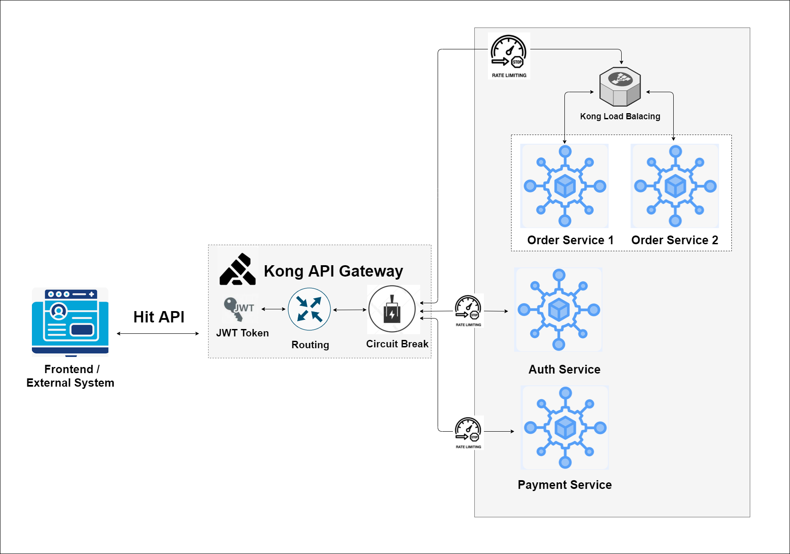

### Architecture Components

| Component | Container Name | Port | Purpose |
|-----------|---------------|------|---------|
| Kong Gateway | kong-gateway | 8000 (proxy), 8001 (admin), 8002 (GUI) | Single entrypoint, routing, plugins |
| Auth Service | auth-service | 3000 | Handles user authentication and token issuance |
| Order Service | order-service | 3000 | Manages order creation and retrieval |
| Payment Service | payment-service | 3000 | Handles payment processing |
| Jaeger | jaeger-tracing | 16686 (UI), 4318 (OTLP) | Distributed tracing backend |
| Network | app-network | — | Bridge network connecting all services |

### Docker Deployment Overview

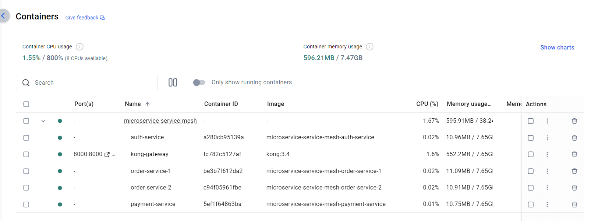

*Screenshot showing the Docker containers deployment for the microservice service mesh with Kong API Gateway.*

### How It Works

1. A client sends a request to `http://localhost:8000/auth`
2. Kong receives the request on its proxy port (8000)
3. Kong matches the request against configured routes (path `/auth` + host `localhost`)
4. If a plugin like JWT is configured, Kong validates the token before forwarding
5. Kong proxies the request to `http://auth-service:3000` over the internal Docker network
6. The microservice processes the request and returns a response
7. Kong sends the response back to the client
8. Meanwhile, OpenTelemetry plugin exports traces to Jaeger for full observability

---

## Core Concepts Explained

### 1. Routing

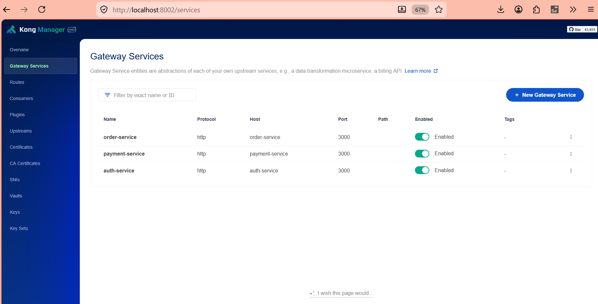

*Screenshot of Kong Gateway showing registered services (auth-service, order-service, payment-service) in Kong Manager UI.*

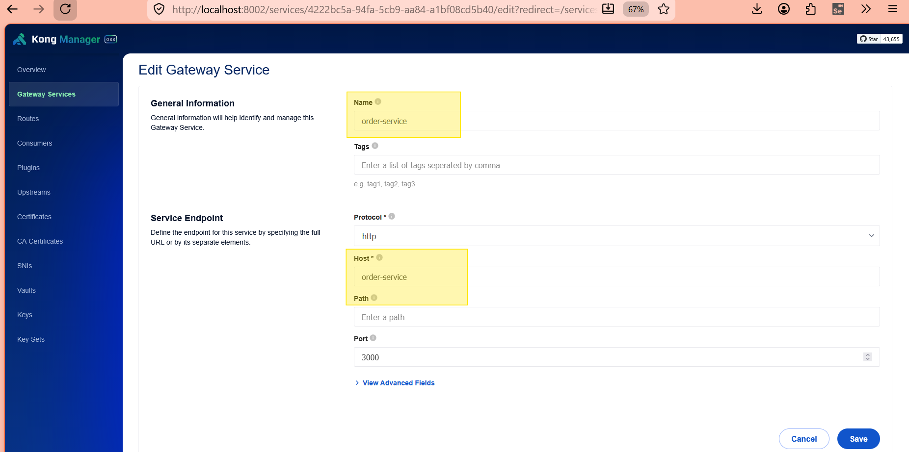

*Screenshot showing how Kong Gateway services are mapped to the upstream microservice URLs (e.g., http://auth-service:3000) on the internal Docker network.*

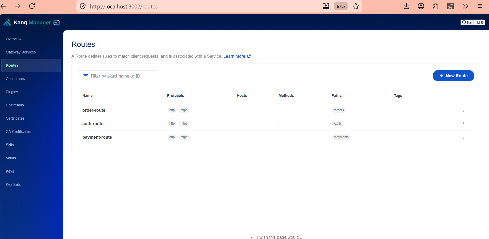

*Screenshot of Kong Manager UI displaying route configuration for each service including paths like `/auth`, `/orders`, and `/payments`.*

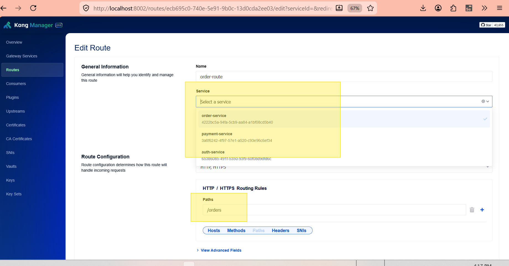

*Screenshot showing the relationship between routes and their associated gateway services—demonstrating how each route is linked to a specific backend service.*

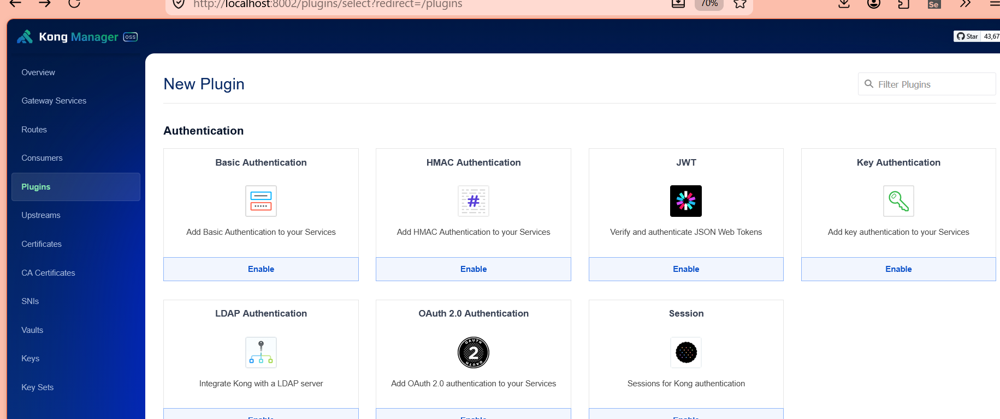

*Screenshot of the available plugin options in Kong Manager, showing the various built-in plugins such as Rate Limiting, JWT, Circuit Breaker, Prometheus, CORS, and OpenTelemetry.*

Routing is the process of matching an incoming HTTP request to a specific upstream service based on rules defined in Kong. A route can match on:
- **Paths**: URL path prefixes or exact matches (e.g., `/auth`, `/orders`, `/payments`)
- **Hosts**: Virtual hostnames (e.g., `localhost`, `api.example.com`)
- **Methods**: HTTP methods like GET, POST, PUT, DELETE, PATCH
- **Headers, Sources, Protocols**: Additional matching criteria

When multiple routes match, Kong uses priority and specificity rules to pick the best one. Routes are linked to Services, and Services point to the actual upstream URL.

#### Configuration Example

```yaml
services:
  - name: auth-service
    url: http://auth-service:3000
    routes:
      - name: auth-route
        paths: [ /auth ]
        hosts: [ localhost ]
        methods: [ GET, POST, PUT, DELETE, PATCH ]
```

This means:
- Any request to `http://localhost:8000/auth` with any HTTP method is forwarded to `http://auth-service:3000`
- The backend service does not need to know about the gateway; it just listens on its own port

#### Why Routing Matters

- Decouples clients from service internals
- Enables versioning (e.g., `/v1/orders`, `/v2/orders`)
- Allows path rewriting, header manipulation, and request/response transformation via plugins

---

### 2. JWT Token (JSON Web Token Authentication)

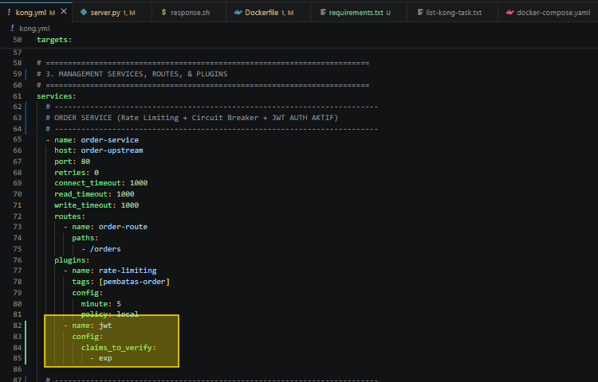

*Screenshot of the Kong JWT plugin configuration showing the form to create a JWT credential with algorithm, secret/key, and issuer fields.*

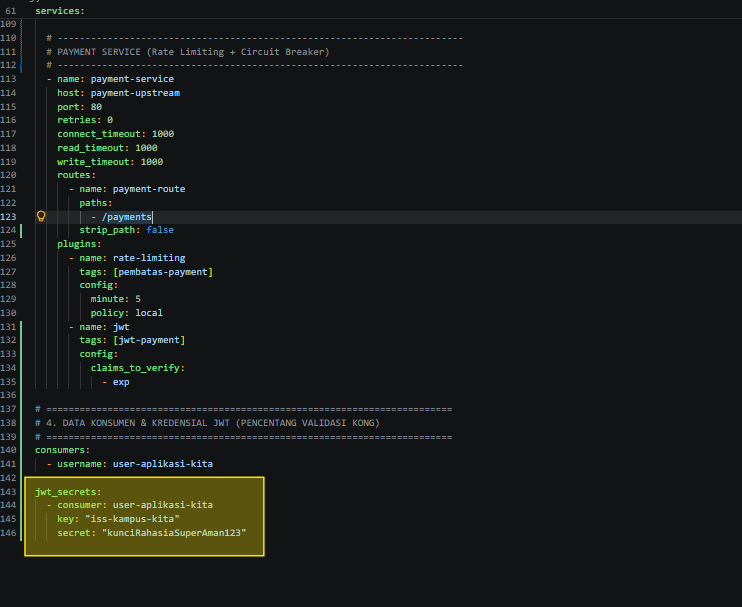

*Additional screenshot of the JWT plugin configuration in Kong Manager, displaying advanced settings such as token expiration and claims validation.*

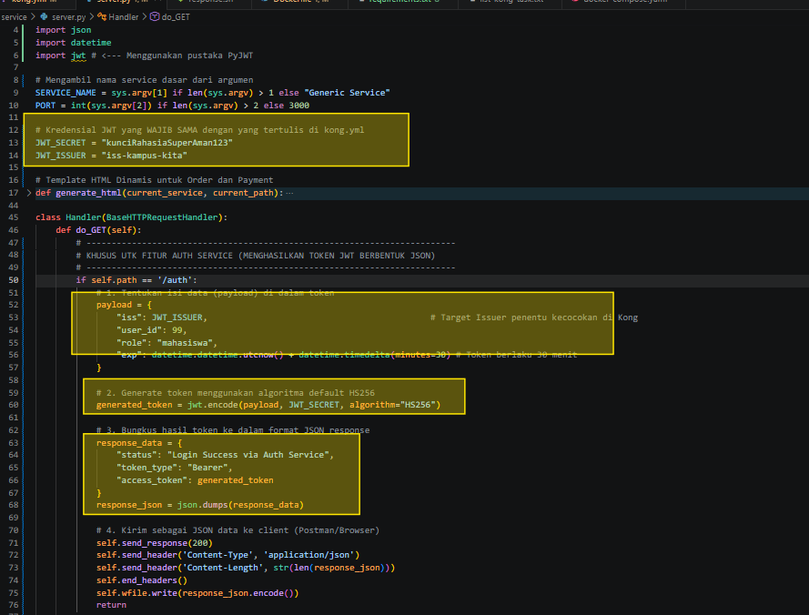

*Screenshot showing the process of creating a JWT credential (consumer) in Kong—defining the key, secret, algorithm, and other token parameters.*

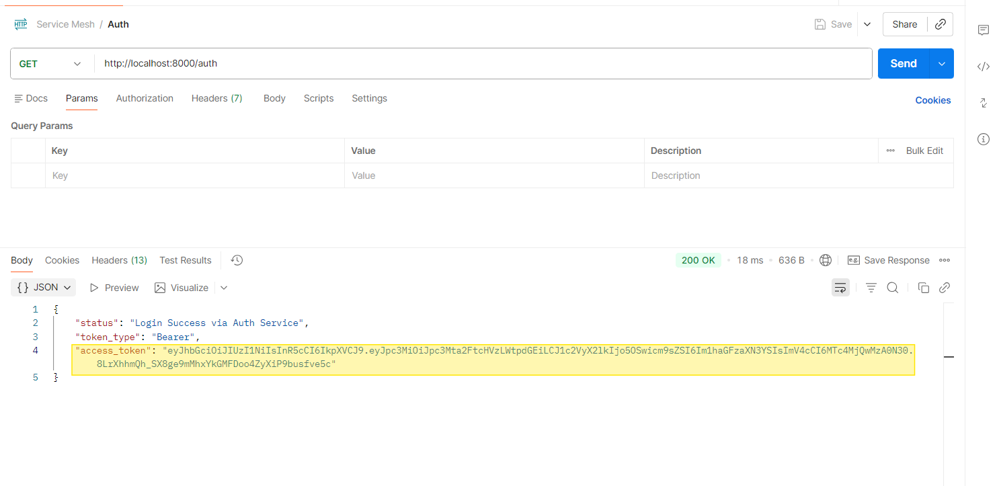

*Screenshot of the first JWT token test—showing the token generation output used to authenticate API requests through Kong Gateway.*

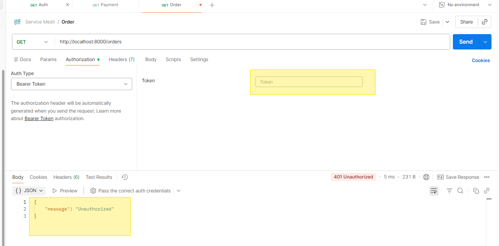

*Screenshot demonstrating the unauthorized access scenario—Kong returns HTTP 401 Unauthorized when a request is made without a valid JWT token or with an invalid/expired token.*

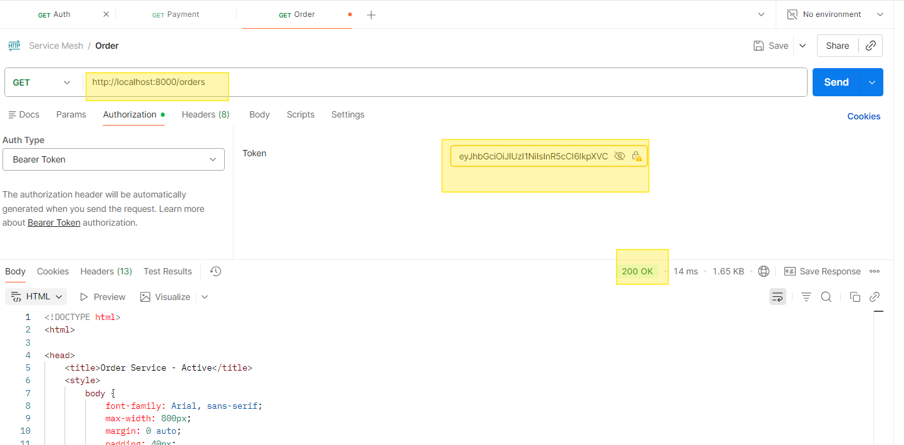

*Screenshot demonstrating successful authorization—Kong returns HTTP 200 OK when a valid JWT token is provided in the Authorization header.*

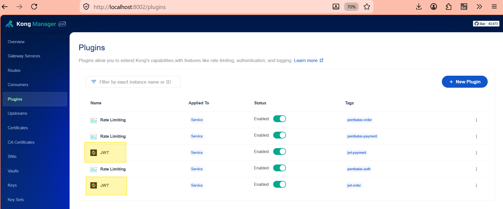

*Screenshot of the JWT Token plugin management interface in Kong Manager GUI, showing the list of configured JWT credentials and their status.*

Kong includes a built-in JWT plugin that validates tokens without touching the backend. The token is typically passed in the `Authorization` header as a Bearer token.

#### Authentication Flow

1. **Credential Creation**: Admin creates a JWT credential in Kong with a secret/key
2. **Token Generation**: A trusted issuer signs a JWT containing claims (user ID, roles, expiration)
3. **Request**: Client sends `Authorization: Bearer <token>`
4. **Validation**: Kong verifies the signature, expiration, and audience
5. **Allow/Deny**: If valid, Kong forwards the request; otherwise returns `401 Unauthorized`
6. **Claims Injection**: Kong optionally adds verified claims to headers for downstream services

#### Benefits

- No authentication code needed in microservices
- Centralized credential management
- Easy token revocation via Kong Admin API
- Supports multiple issuers and key rotation

---

### 3. Circuit Breaker

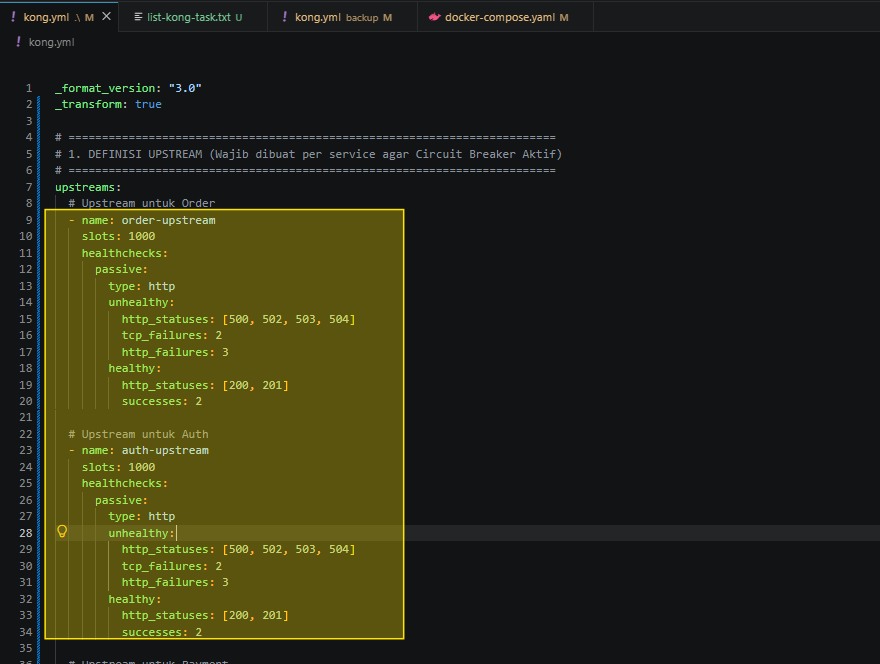

*Screenshot of the Kong Circuit Breaker plugin configuration showing parameters such as failure thresholds, timeout duration, and unhealthy status codes that trigger the circuit to open.*

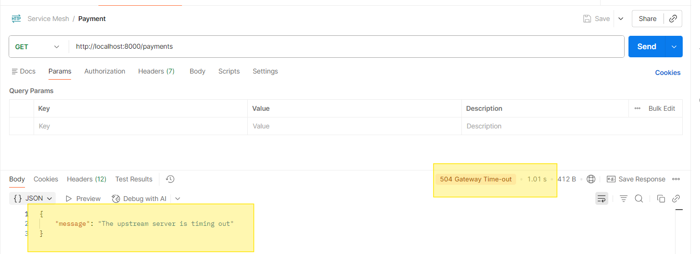

*Screenshot demonstrating the Circuit Breaker test—showing the HTTP 503 Service Unavailable response returned by Kong when the circuit is open and requests are blocked from reaching the failing upstream service.*

The Circuit Breaker plugin protects the system from cascading failures. It monitors the health of upstream services and, when failure thresholds are exceeded, "trips" the circuit to prevent further damage.

#### Circuit States

- **Closed**: Normal operation; requests flow through; failures are counted
- **Open**: Too many failures detected; Kong immediately returns fallback responses (e.g., 503) without hitting the upstream
- **Half-Open**: After a cooldown period, Kong allows a limited number of test requests to check if the service recovered

#### Configuration Triggers

- **Trip when failures exceed X% in Y seconds**
- **Trip when response time exceeds Z ms**
- **Unhealthy status codes** (e.g., 500, 502, 503, 504)

#### Why It Matters

Imagine `payment-service` is under heavy load and starts timing out. Without a circuit breaker, every request from Kong would wait for the timeout, exhausting connections and crashing the gateway. With a circuit breaker, Kong stops sending traffic to the failing service, gives it time to recover, and returns fast failure responses to clients.

---

### 4. Rate Limiting

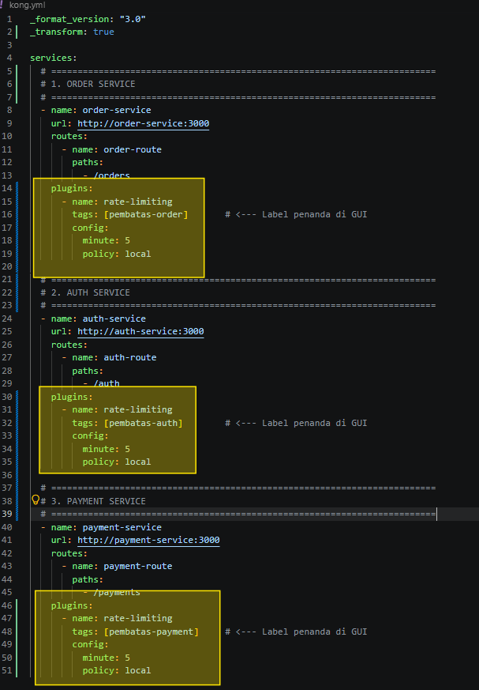

*Screenshot of the Kong Rate Limiting plugin configuration showing parameter settings such as requests per minute, hour, and the limit policy (local/Redis).*

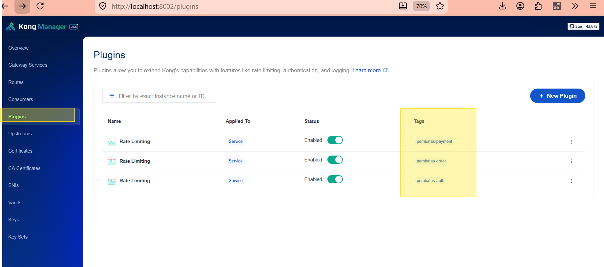

*Screenshot of the Rate Limiting plugin configuration interface in Kong Manager GUI, displaying the form fields to configure rate limit thresholds and enforcement strategy.*

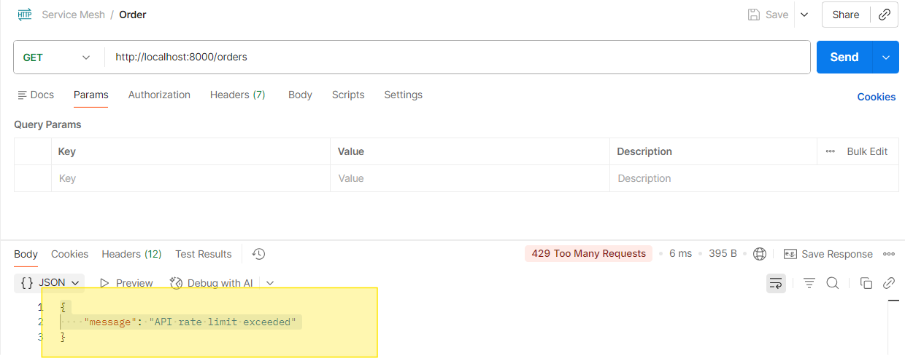

*Screenshot demonstrating the Rate Limiting plugin in action—showing the HTTP response when the rate limit is exceeded (e.g., HTTP 429 Too Many Requests).*

Rate limiting controls the number of requests a client can make within a time window. It prevents abuse, ensures fair usage, and protects backend services from traffic spikes.

#### Implementation Strategies

- **Local**: Limits tracked in memory on each Kong node (simple, less accurate in clustered setups)
- **Redis**: Centralized limits across multiple Kong instances (requires Redis plugin)

#### Algorithms

- **Fixed Window**: Counts requests in fixed time slots (e.g., 100 requests per minute)
- **Sliding Window**: Smoother rate limiting over a rolling window
- **Sliding Log**: Exact tracking of request timestamps (most accurate, higher memory)

#### Example Configuration

```yaml
plugins:
  - name: rate-limiting
    config:
      minute: 100        # Max 100 requests per minute per client
      hour: 1000         # Max 1000 requests per hour per client
      policy: local      # Use in-memory tracking
      limit_by: consumer # Apply limit per API key / consumer
```

#### Real-World Use Cases

- Free tier: 100 requests/day
- Prevent DDoS and brute-force attacks
- Enforce SLA tiers (Basic vs Pro vs Enterprise)
- Protect database from sudden traffic spikes

---

### 5. Load Balancing

Kong supports load balancing across multiple upstream instances of the same service. This is critical for scalability and high availability.

#### Upstreams and Targets

- **Upstream**: Logical name for a group of backend instances (e.g., `order-service`)
- **Target**: A specific host:port combination (e.g., `order-service:3000`)

#### Load Balancing Algorithms

- **Round Robin**: Distributes requests sequentially across targets (default)
- **Least Connections**: Routes to the target with fewest active connections
- **Consistent Hashing**: Routes based on a hash key (e.g., user ID) for sticky sessions
- **P2C (Power of Two Choices)**: Picks two random targets and selects the one with fewer connections (good latency, low overhead)

#### Load Balancing Configuration

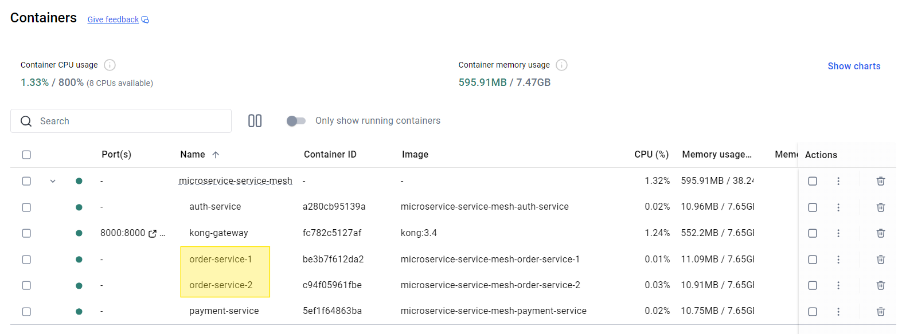

*Screenshot showing the Kong load balancing configuration with multiple upstream targets for the order service—demonstrating how several service instances are registered as targets behind a single upstream.*

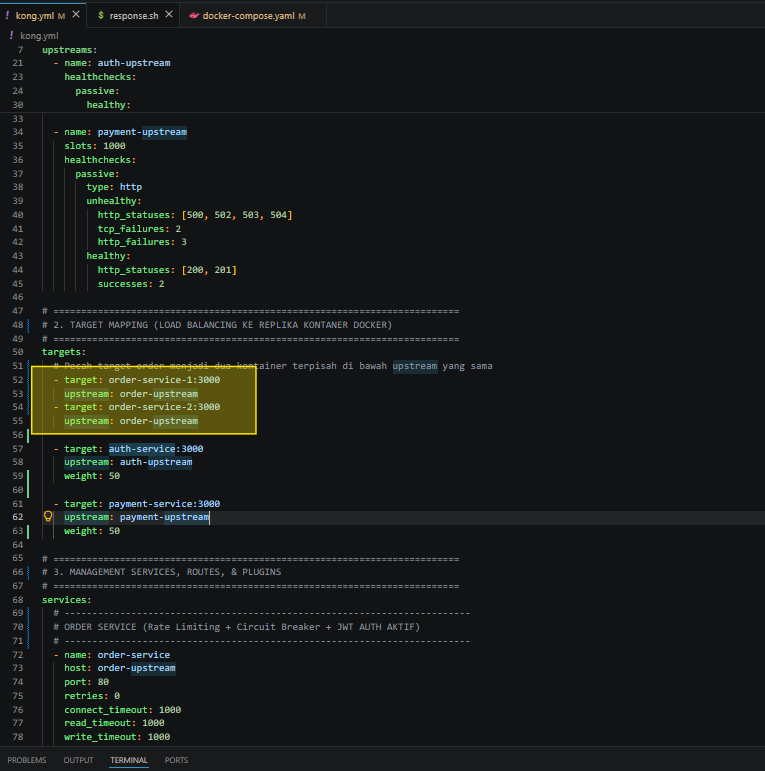

*Screenshot of the Kong load balancer configuration page displaying the Round Robin algorithm selection and target health status for the order service upstream.*

#### Round Robin Example

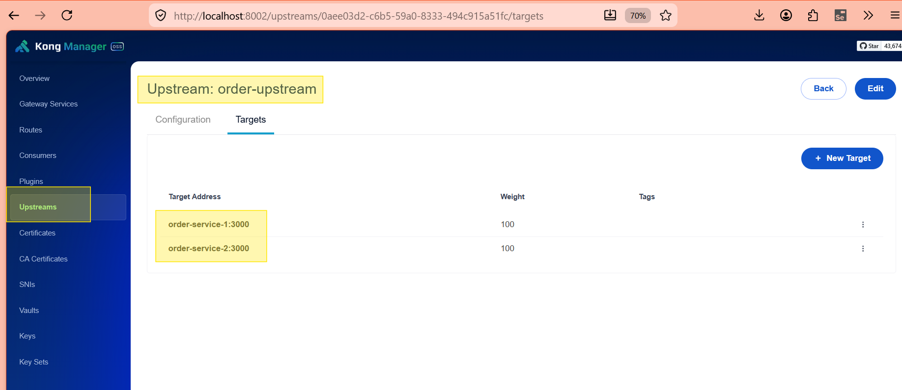

If you scale `order-service` to 2 replicas:
```bash
docker-compose up --scale order-service=3
```

Kong will automatically distribute requests across:
- `order-service-1:3000`
- `order-service-2:3000`

#### Health Checks

Kong can perform active health checks to automatically remove unhealthy targets from the load balancer pool and add them back when they recover.

---

## Quick Start

### Prerequisites

- Docker and Docker Compose installed
- At least 2GB of free RAM
- Ports 8000, 8001, 8002, 16686 available on localhost

### Running the Stack

```bash
# Start all services
docker-compose up -d --build

# Verify Kong is running
curl.exe -s http://localhost:8001/services

# Expected output: JSON list of auth-service, order-service, payment-service
```

### Testing the Gateway

```bash
# Test auth service routing
curl.exe -s http://localhost:8000/auth -H "Host: localhost"

# Test order service routing
curl.exe -s http://localhost:8000/orders -H "Host: localhost"

# Test payment service routing
curl.exe -s http://localhost:8000/payments -H "Host: localhost"
```

### Accessing Management UIs

| Service | URL | Credentials |
|---------|-----|-------------|
| Kong Manager | http://localhost:8002 | None (default) |
| Kong Admin API | http://localhost:8001 | None (default) |
| Jaeger UI | http://localhost:16686 | None (default) |

---

## Configuration Files

### `kong.yml`
Declarative Kong configuration in DB-less mode. Defines:
- 3 services with upstream URLs
- 3 routes with path/host/method matching
- 4 global plugins: prometheus, cors, rate-limiting, opentelemetry
- Per-service OpenTelemetry plugins for service-specific trace naming

### `docker-compose.yaml`
Orchestrates all containers:
- Kong 3.4 image with declarative config mounted
- 3 Python microservices built from `./service`
- Jaeger all-in-one for tracing
- Shared `app-network` bridge network

### `service/server.py`
The Python microservice that dynamically responds based on command-line arguments:
- `sys.argv[1]`: Service name (e.g., "Auth Service")
- `sys.argv[2]`: Port number (e.g., "3000")
- Serves an HTML dashboard showing service status and endpoint info


---

## Project Structure

```
.
├── docker-compose.yaml      # Container orchestration
├── kong.yml                 # Kong declarative configuration
└── service/
    ├── Dockerfile           # Python service image
    ├── server.py            # Microservice application
    └── response.sh          # Startup script
```
